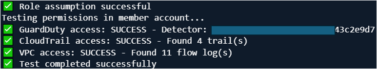
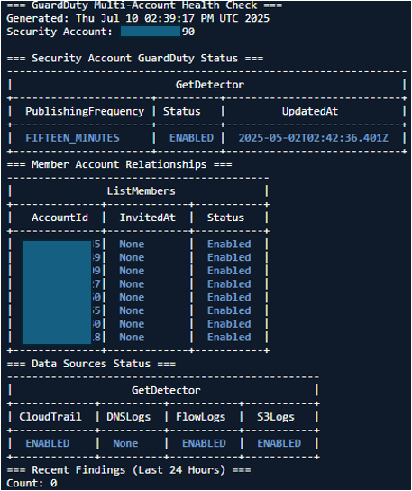
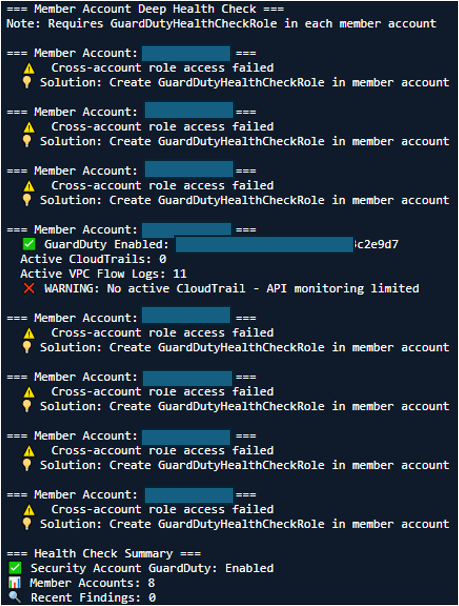

# GuardDuty Cross-Account Health Check Setup

> **Overview**: This guide sets up cross-account roles for GuardDuty health monitoring. The Security Account will assume roles in Member Accounts to perform health checks.

---

## 🏢 MEMBER ACCOUNT COMMANDS

> **Purpose**: Create a cross-account role that allows the Security Account to perform GuardDuty health checks
> 
> **Run Location**: Execute these commands in **each Member Account** CloudShell
> 
> **What it does**: Creates GuardDutyHealthCheckRole with read-only permissions for GuardDuty, CloudTrail, and VPC

### Step 1: Set Security Account ID
```bash
# Replace with your actual Security Account ID
SECURITY_ACCOUNT_ID="333333333333"
```

### Step 2: Create Cross-Account Trust Policy
```bash
cat > trust-policy.json << EOF
{
    "Version": "2012-10-17",
    "Statement": [
        {
            "Effect": "Allow",
            "Principal": {
                "AWS": "arn:aws:iam::${SECURITY_ACCOUNT_ID}:root"
            },
            "Action": "sts:AssumeRole"
        }
    ]
}
EOF
```

### Step 3: Create IAM Role
```bash
aws iam create-role \
    --role-name GuardDutyHealthCheckRole \
    --assume-role-policy-document file://trust-policy.json
```

### Step 4: Attach Required Policies
```bash
# GuardDuty read access
aws iam attach-role-policy \
    --role-name GuardDutyHealthCheckRole \
    --policy-arn arn:aws:iam::aws:policy/AmazonGuardDutyReadOnlyAccess

# CloudTrail read access
aws iam attach-role-policy \
    --role-name GuardDutyHealthCheckRole \
    --policy-arn arn:aws:iam::aws:policy/AWSCloudTrail_ReadOnlyAccess

# VPC read access
aws iam attach-role-policy \
    --role-name GuardDutyHealthCheckRole \
    --policy-arn arn:aws:iam::aws:policy/AmazonVPCReadOnlyAccess

echo "✅ GuardDutyHealthCheckRole created successfully"
```

### Step 5: Verify Role Creation (Member Account)
```bash
# Verify role exists
aws iam get-role \
    --role-name GuardDutyHealthCheckRole \
    --query 'Role.{RoleName:RoleName,CreateDate:CreateDate}' \
    --output table

# Verify attached policies
aws iam list-attached-role-policies \
    --role-name GuardDutyHealthCheckRole \
    --output table
```

---

## 🔒 SECURITY ACCOUNT COMMANDS

> **Purpose**: Test cross-account role access and perform GuardDuty health checks across all member accounts
> 
> **Run Location**: Execute these commands in the **Security Account** CloudShell
> 
> **What it does**: Assumes roles in member accounts to validate GuardDuty configuration and generate health reports

### Option 1: Quick Role Test
```bash
# Replace with actual member account ID
MEMBER_ACCOUNT_ID="444444444444"

# Test basic role assumption
aws sts assume-role \
    --role-arn "arn:aws:iam::${MEMBER_ACCOUNT_ID}:role/GuardDutyHealthCheckRole" \
    --role-session-name "TestSession" \
    --query 'AssumedRoleUser.Arn' \
    --output text
```

### If it fails:
``` text
   Role doesn't exist in the member account
   Trust policy doesn't allow the security account to assume it
   Insufficient permissions in the calling account
   This is a safe test - it only verifies role assumption capability without actually using the temporary credentials to access GuardDuty resources.
```

### Option 2: Comprehensive Permission Test
```bash
# Replace with actual member account ID
MEMBER_ACCOUNT_ID="444444444444"

echo "=== Testing Cross-Account Access ==="

# Test role assumption and permissions
TEMP_CREDS=$(aws sts assume-role \
    --role-arn "arn:aws:iam::${MEMBER_ACCOUNT_ID}:role/GuardDutyHealthCheckRole" \
    --role-session-name "TestSession" 2>/dev/null)

if [ $? -eq 0 ]; then
    echo "✅ Role assumption successful"
    
    # Use temporary credentials
    export AWS_ACCESS_KEY_ID=$(echo $TEMP_CREDS | jq -r '.Credentials.AccessKeyId')
    export AWS_SECRET_ACCESS_KEY=$(echo $TEMP_CREDS | jq -r '.Credentials.SecretAccessKey')
    export AWS_SESSION_TOKEN=$(echo $TEMP_CREDS | jq -r '.Credentials.SessionToken')
    
    echo "Testing permissions in member account..."
    
    # Test GuardDuty access
    DETECTOR_TEST=$(aws guardduty list-detectors --query 'DetectorIds[0]' --output text 2>/dev/null)
    if [ "$DETECTOR_TEST" != "None" ] && [ ! -z "$DETECTOR_TEST" ]; then
        echo "✅ GuardDuty access: SUCCESS - Detector: $DETECTOR_TEST"
    else
        echo "⚠️  GuardDuty access: No detector found"
    fi
    
    # Test CloudTrail access
    TRAIL_COUNT=$(aws cloudtrail describe-trails --query 'length(trailList)' --output text 2>/dev/null)
    if [ $? -eq 0 ]; then
        echo "✅ CloudTrail access: SUCCESS - Found $TRAIL_COUNT trail(s)"
    else
        echo "❌ CloudTrail access: FAILED"
    fi
    
    # Test VPC access
    FLOW_LOG_COUNT=$(aws ec2 describe-flow-logs --query 'length(FlowLogs)' --output text 2>/dev/null)
    if [ $? -eq 0 ]; then
        echo "✅ VPC access: SUCCESS - Found $FLOW_LOG_COUNT flow log(s)"
    else
        echo "❌ VPC access: FAILED"
    fi
    
    # Clean up credentials
    unset AWS_ACCESS_KEY_ID AWS_SECRET_ACCESS_KEY AWS_SESSION_TOKEN
    echo "✅ Test completed successfully"
else
    echo "❌ Role assumption failed - check role exists in member account"
fi
```
### GuardDuty Option 2 Result


### Option 3: Create Reusable Test Script
```bash
# Create test script for repeated use
cat > test-guardduty-role.sh << 'EOF'
#!/bin/bash

# Replace with actual member account ID
MEMBER_ACCOUNT_ID="444444444444"

echo "=== Testing GuardDuty Cross-Account Role ==="
echo "Member Account: $MEMBER_ACCOUNT_ID"
echo ""

# Test role assumption
TEMP_CREDS=$(aws sts assume-role \
    --role-arn "arn:aws:iam::${MEMBER_ACCOUNT_ID}:role/GuardDutyHealthCheckRole" \
    --role-session-name "TestSession" 2>/dev/null)

if [ $? -eq 0 ]; then
    echo "✅ Role assumption successful"
    
    # Use temporary credentials
    export AWS_ACCESS_KEY_ID=$(echo $TEMP_CREDS | jq -r '.Credentials.AccessKeyId')
    export AWS_SECRET_ACCESS_KEY=$(echo $TEMP_CREDS | jq -r '.Credentials.SecretAccessKey')
    export AWS_SESSION_TOKEN=$(echo $TEMP_CREDS | jq -r '.Credentials.SessionToken')
    
    # Test all required permissions
    DETECTOR_TEST=$(aws guardduty list-detectors --query 'DetectorIds[0]' --output text 2>/dev/null)
    TRAIL_COUNT=$(aws cloudtrail describe-trails --query 'length(trailList)' --output text 2>/dev/null)
    FLOW_LOG_COUNT=$(aws ec2 describe-flow-logs --query 'length(FlowLogs)' --output text 2>/dev/null)
    
    echo "GuardDuty Detector: ${DETECTOR_TEST:-None}"
    echo "CloudTrail Count: ${TRAIL_COUNT:-0}"
    echo "VPC Flow Logs: ${FLOW_LOG_COUNT:-0}"
    
    # Clean up
    unset AWS_ACCESS_KEY_ID AWS_SECRET_ACCESS_KEY AWS_SESSION_TOKEN
else
    echo "❌ Role assumption failed"
fi
EOF

# Make executable and run
chmod +x test-guardduty-role.sh
./test-guardduty-role.sh
```

### Option 4: Complete Health Check Script
> **Purpose**: Comprehensive GuardDuty health monitoring across all member accounts

```bash
cat > guardduty-health-check.sh << 'EOF'
#!/bin/bash

echo "=== GuardDuty Multi-Account Health Check ==="
echo "Generated: $(date)"
echo "Security Account: $(aws sts get-caller-identity --query Account --output text)"
echo ""

# Get Security Account GuardDuty detector
DETECTOR_ID=$(aws guardduty list-detectors --query 'DetectorIds[0]' --output text)

if [ "$DETECTOR_ID" = "None" ] || [ -z "$DETECTOR_ID" ]; then
    echo "❌ No GuardDuty detector found in Security Account"
    exit 1
fi

echo "=== Security Account GuardDuty Status ==="
aws guardduty get-detector --detector-id $DETECTOR_ID \
    --query '{Status:Status,PublishingFrequency:FindingPublishingFrequency,UpdatedAt:UpdatedAt}' \
    --output table

echo "=== Member Account Relationships ==="
aws guardduty list-members --detector-id $DETECTOR_ID \
    --query 'Members[].{AccountId:AccountId,Status:RelationshipStatus,InvitedAt:InvitedAt}' \
    --output table

echo "=== Data Sources Status ==="
aws guardduty get-detector --detector-id $DETECTOR_ID \
    --query 'DataSources.{CloudTrail:CloudTrail.Status,DNSLogs:DnsLogs.Status,FlowLogs:FlowLogs.Status,S3Logs:S3Logs.Status}' \
    --output table

echo "=== Recent Findings (Last 24 Hours) ==="
RECENT_FINDINGS=$(aws guardduty list-findings --detector-id $DETECTOR_ID --finding-criteria '{
  "Criterion": {
    "updatedAt": {
      "Gte": '$(date -d '24 hours ago' +%s)000'
    }
  }
}' --query 'length(FindingIds)' --output text)
echo "Count: $RECENT_FINDINGS"
echo ""

# Cross-Account Member Validation
echo "=== Member Account Deep Health Check ==="
echo "Note: Requires GuardDutyHealthCheckRole in each member account"
echo ""

# Get enabled member accounts
MEMBER_ACCOUNTS=$(aws guardduty list-members --detector-id $DETECTOR_ID \
    --query 'Members[?RelationshipStatus==`Enabled`].AccountId' --output text)

if [ ! -z "$MEMBER_ACCOUNTS" ]; then
    for ACCOUNT_ID in $MEMBER_ACCOUNTS; do
        echo "=== Member Account: $ACCOUNT_ID ==="
        
        ROLE_ARN="arn:aws:iam::${ACCOUNT_ID}:role/GuardDutyHealthCheckRole"
        
        # Attempt cross-account role assumption
        TEMP_CREDS=$(aws sts assume-role --role-arn "$ROLE_ARN" \
            --role-session-name "GuardDutyHealthCheck" 2>/dev/null)
        
        if [ $? -eq 0 ]; then
            # Use member account credentials
            export AWS_ACCESS_KEY_ID=$(echo $TEMP_CREDS | jq -r '.Credentials.AccessKeyId')
            export AWS_SECRET_ACCESS_KEY=$(echo $TEMP_CREDS | jq -r '.Credentials.SecretAccessKey')
            export AWS_SESSION_TOKEN=$(echo $TEMP_CREDS | jq -r '.Credentials.SessionToken')
            
            # Check member account GuardDuty
            MEMBER_DETECTOR=$(aws guardduty list-detectors --query 'DetectorIds[0]' --output text 2>/dev/null)
            
            if [ "$MEMBER_DETECTOR" != "None" ] && [ ! -z "$MEMBER_DETECTOR" ]; then
                echo "  ✅ GuardDuty Enabled: $MEMBER_DETECTOR"
                
                # Check supporting services
                ACTIVE_TRAILS=$(aws cloudtrail describe-trails \
                    --query 'length(trailList[?IsLogging==`true`])' --output text 2>/dev/null)
                ACTIVE_FLOW_LOGS=$(aws ec2 describe-flow-logs \
                    --query 'length(FlowLogs[?FlowLogStatus==`ACTIVE`])' --output text 2>/dev/null)
                
                echo "  Active CloudTrails: ${ACTIVE_TRAILS:-0}"
                echo "  Active VPC Flow Logs: ${ACTIVE_FLOW_LOGS:-0}"
                
                # Health warnings
                if [ "${ACTIVE_TRAILS:-0}" -eq 0 ]; then
                    echo "  ❌ WARNING: No active CloudTrail - API monitoring limited"
                fi
                
                if [ "${ACTIVE_FLOW_LOGS:-0}" -eq 0 ]; then
                    echo "  ❌ WARNING: No active VPC Flow Logs - Network monitoring limited"
                fi
            else
                echo "  ❌ GuardDuty NOT enabled in member account"
            fi
            
            # Clean up credentials
            unset AWS_ACCESS_KEY_ID AWS_SECRET_ACCESS_KEY AWS_SESSION_TOKEN
        else
            echo "  ⚠️  Cross-account role access failed"
            echo "  💡 Solution: Create GuardDutyHealthCheckRole in member account"
        fi
        
        echo ""
    done
else
    echo "No enabled member accounts found"
fi

echo "=== Health Check Summary ==="
echo "✅ Security Account GuardDuty: Enabled"
echo "📊 Member Accounts: $(echo $MEMBER_ACCOUNTS | wc -w)"
echo "🔍 Recent Findings: $RECENT_FINDINGS"
echo ""
echo "💡 Setup Instructions:"
echo "   1. Run member account commands in each member account"
echo "   2. Ensure GuardDuty is enabled in all accounts"
echo "   3. Configure CloudTrail and VPC Flow Logs for complete monitoring"
EOF

# Make executable
chmod +x guardduty-health-check.sh
echo "✅ Health check script created: ./guardduty-health-check.sh"
echo "Run with: ./guardduty-health-check.sh"
```

---

### GuardDuty Health Check Result


### GuardDuty Health Check Result



## 📋 Quick Reference

### Member Account Setup Checklist
- [ ] Set SECURITY_ACCOUNT_ID variable
- [ ] Create trust policy file
- [ ] Create GuardDutyHealthCheckRole
- [ ] Attach required policies
- [ ] Verify role creation

### Security Account Testing Checklist
- [ ] Test basic role assumption
- [ ] Verify GuardDuty access
- [ ] Check CloudTrail permissions
- [ ] Validate VPC access
- [ ] Run comprehensive health check

### Expected Results
- ✅ Role assumption successful
- ✅ GuardDuty detector access
- ✅ CloudTrail read access
- ✅ VPC Flow Logs access
- ✅ Cross-account health monitoring enabled
